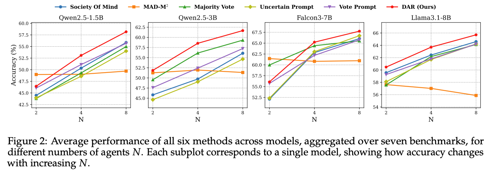

<div align="center">

  <h1><b> DAR Library: Diversity-Aware Retention for Multi-Agent Debate </b></h1>
  <p><i>Fast, modular, and diversity-aware — the open-source library for Multi-Agent Debate research.</i></p>
</div>

<div align="center">

[](https://github.com/DA2I2-SLM/DAR/blob/main/LICENSE)
[](https://www.python.org/)
[](https://github.com/vllm-project/vllm)
[](https://arxiv.org/abs/2603.20640)

</div>

<div align="center">

🚀 [**Getting Started**](#install) **|**
🔧 [**Usage**](#usage) **|**
🎯 [**Benchmarks**](#bench) **|**
🧠 [**Baselines**](#baselines) **|**
📂 [**Project Structure**](#structure) **|**
🤝 [**Todo**](#todo)

</div>

**DAR Library** is a fast, modular open-source library for **Multi-Agent Debate (MAD)** research. Powered by [vLLM](https://github.com/vllm-project/vllm), DAR Library delivers significantly faster inference than existing MAD frameworks, making large-scale debate experiments accessible and reproducible.
🎉 DAR Library ships with a comprehensive collection of SOTA MAD baselines out of the box, including our own [**Diversity-Aware Retention (DAR)**](https://arxiv.org/abs/2603.20640) method, so you can benchmark, extend, and build on the latest research in minutes.
✨ If you find DAR Library helpful, please share your feedback, cite our work, and give it a ⭐. Your support means a lot!

**Why DAR Library?**
- DAR Library is **up to 100× faster** than existing MAD libraries thanks to native vLLM integration with batched inference. Run more experiments, wait less.
- DAR Library ships with **SOTA baselines** including uncertainty-aware prompting, voting mechanisms, uncertainty-based filtering, persona, society of minds, and topology variants (sparse, centralized), all in one place.
- DAR Library is **modular and extensible**. Adding a new model, benchmark, or filtering strategy takes only a few lines of code.

**About Our DAR Method:**
- DAR's core idea is simple: rather than forwarding all agent messages each round, **only the most diverse and informative messages are retained**. As such, DAR incorporates 3 controlling mechanisms:
   + 🔵 **Uncertainty Prompt:** agents signal their confidence alongside their answers
   + 🗳️ **Vote Prompt:** agents vote across candidate answers to surface consensus
   + ✂️ **Critical Filtering:** only messages that challenge or diversify the consensus are retained for the next round
- DAR delivers cost savings by streamlining agent communication, reducing message volume by up to 30–40%.
- DAR scales seamlessly with agent growth, driving significant gains in performance (see example below).
  
<div align="center">

</div>

📜 For more details, check out our [paper](https://arxiv.org/abs/2603.20640).
Please feel free to open issues or pull requests. We're constantly working to improve and expand the library.

> [!IMPORTANT]
> If you find this repository helpful for your work, please consider citing as follows:
>
> ```LaTeX
> @article{nguyen2026hear,
>   title={Hear Both Sides: Efficient Multi-Agent Debate via Diversity-Aware Message Retention},
>   author={Nguyen, Manh and Nguyen, Anh and Nguyen, Dung and Venkatesh, Svetha and Le, Hung},
>   journal={arXiv preprint arXiv:2603.20640},
>   year={2026}
> }
> ```

---

## <a name="install"></a> 🚀 Installation and Quick Start

#### ⏬ Cloning the Repository

```bash
git clone https://github.com/DA2I2-SLM/DAR.git
cd DAR
```

#### 💿 Installing Dependencies

Python 3.10 or higher is recommended.

```bash
conda create -n dar python=3.10.16 -y
conda activate dar
pip install -r requirements.txt
```

> 📌
> **Using gated models (Llama-3.1 or Gemma)?** Make sure you have requested access on Hugging Face and export your token before running any scripts:
> ```bash
> export HF_TOKEN="your_huggingface_token_here"
> ```
> For Hugging Face inference mode (no vLLM, slow), also place your token in a file named `token` (single line, no quotes).

---

## <a name="usage"></a> 🔧 Usage

Run a [basic MAD](https://arxiv.org/abs/2305.14325) experiment on the Arithmetics dataset:

```bash
python src/main.py --model qwen2.5-1.5b --num_agents 4 --data arithmetics --data_size 100 --debate_rounds 2
```

**Topology flags** (append to any command):
- Default: fully-connected
- `--sparse`: sparse graph topology
- `--centralized`: centralized (hub-and-spoke) topology

**Persona flag:**
- `--multi_persona`: enables heterogeneous agent personas

**Inference backend:**
- Default: vLLM (fast, batched — recommended for most benchmarks)
- `--use_hf_inference --hf_batch_size 16`: Hugging Face Transformers backend (recommended for math datasets if using A100/H100 GPU; adjust batch size based on available memory)
>✍️ Note: vLLM and HF backends may produce different results due to mismatches in sampling behavior and log-probability computation.

Implementation details for the filtering algorithms can be found in [`src/dev.py`](./src/dev.py).

#### ⚡ Quick Validation

Run a quick end-to-end validation of the full DAR pipeline with Qwen2.5-1.5B:

```bash
bash scripts/validate.sh
```

> ✍️ Note: due to vLLM sampling non-determinism, results may vary slightly across runs. We report averages over multiple seeds with standard deviations in the paper.

---

## <a name="bench"></a> 🎯 Benchmarks

#### ☝️ Tested Models

- `Qwen2.5-1.5B`, `Qwen2.5-3B`
- `Llama3.1-8B`
- `Falcon3-7B`

#### ✌️ Supported Benchmarks

- **Math**: Arithmetics, GSM8K
- **QA**: MMLU (Formal Logic, Professional Medicine), HH-RLHF, CommonSenseQA

Datasets are handled automatically via `data/data_utils.py` — just pass the dataset name to `--data`.

#### 🔬 Running Full Benchmark Experiments

Complete run commands for every benchmark are provided in `scripts/`. Below are representative examples.

**Arithmetics, Qwen2.5-1.5B, DAR (vLLM backend):**
```bash
python src/main.py --model qwen2.5-1.5b --num_agents 4 --data arithmetics --data_size 100 --debate_rounds 2 \
  --uncertainty_prompt True --vote_prompt True --m_role filter_critical
```

**Arithmetics, Qwen2.5-1.5B, DAR (HF backend):**
```bash
python src/main.py --model qwen2.5-1.5b --num_agents 4 --data arithmetics --data_size 100 --debate_rounds 2 \
  --uncertainty_prompt True --vote_prompt True --m_role filter_critical \
  --use_hf_inference --hf_batch_size 16
```

> ✍️ Note: We observe that Hugging Face inference helps MAD perform better on mathematical datasets on certain GPUs.

#### 📒 Results and Logs

After each run:
- **Accuracy metrics** are appended to `out/<dataset>_vllm_batch_logs.tsv`
- **Full debate history** (agent messages, uncertainty scores ANLL, final answers) is serialized to `out/history/<experiment_name>.jsonl`
- Use `--debug` to prepend `DEBUG_` to the output filename for quick inspection runs

---

## <a name="baselines"></a> 🧠 Baselines

DAR ships with a full set of MAD baselines so you can fairly compare against prior work out of the box. Please refer to our [paper](https://arxiv.org/abs/2305.14325) for more information on the baselines.

#### ☝️ Standard Baselines

**Basic MAD (no filtering):**
```bash
python src/main.py --model qwen2.5-1.5b --num_agents 4 --data arithmetics --data_size 100 --debate_rounds 2
```

**Top-K Uncertainty Filtering (retain 50% most certain):**
```bash
python src/main.py --model qwen2.5-1.5b --num_agents 4 --data arithmetics --data_size 100 --debate_rounds 2 --top_k_uncertainty 0.5
```

**Uncertainty Prompt only:**
```bash
python src/main.py --model qwen2.5-1.5b --num_agents 4 --data arithmetics --data_size 100 --debate_rounds 2 --uncertainty_prompt True
```

**Vote Prompt only:**
```bash
python src/main.py --model qwen2.5-1.5b --num_agents 4 --data arithmetics --data_size 100 --debate_rounds 2 --vote_prompt True
```

#### ✌️ Our Method: DAR = Uncertainty Prompt + Vote Prompt + Critical Filtering

**vLLM backend (default, fastest):**
```bash
python src/main.py --model qwen2.5-1.5b --num_agents 4 --data arithmetics --data_size 100 --debate_rounds 2 \
  --uncertainty_prompt True --vote_prompt True --m_role filter_critical
```

**HF backend:**
```bash
python src/main.py --model qwen2.5-1.5b --num_agents 4 --data arithmetics --data_size 100 --debate_rounds 2 \
  --uncertainty_prompt True --vote_prompt True --m_role filter_critical \
  --use_hf_inference --hf_batch_size 16
```

**With a separate LLM Filtering Moderator:**
```bash
python src/main.py --model qwen2.5-3b --num_agents 4 --data arithmetics --data_size 100 --debate_rounds 2 \
  --uncertainty_prompt True --vote_prompt True --m_role filter_critical --separate_moderator qwen2.5-1.5b
```

<details><summary>Ablation variants (retaining criteria)</summary>

```bash
# Retain most certain messages
python src/main.py --model qwen2.5-1.5b --num_agents 4 --data arithmetics --data_size 100 --debate_rounds 2 \
  --uncertainty_prompt True --vote_prompt True --m_role filter_certain

# Retain supporting messages
python src/main.py --model qwen2.5-1.5b --num_agents 4 --data arithmetics --data_size 100 --debate_rounds 2 \
  --uncertainty_prompt True --vote_prompt True --m_role filter_support

# Retain non-voting messages
python src/main.py --model qwen2.5-1.5b --num_agents 4 --data arithmetics --data_size 100 --debate_rounds 2 \
  --uncertainty_prompt True --vote_prompt True --m_role filter_nonvote
```

</details>

---

## <a name="structure"></a> 📂 Project Structure

```text
DAR/
├── data/              # Raw benchmark datasets (auto-downloaded and processed)
├── out/               # TSV metric summaries + JSONL full debate history logs
├── result/            # Runtime operation and token logs
├── scripts/           # Bash scripts for large-scale benchmark experiments
└── src/
    ├── main.py        # Main entry point for the Multi-Agent Debate pipeline
    ├── dev.py         # Filtering algorithms (filter_critical, filter_support, etc.)
    ├── evaluator.py   # Metric evaluation and regex parsing of model outputs
    └── model/         # vLLM initialization and sampling configurations
```

---

## <a name="todo"></a> 🤝 Things to Do

- [X] Core MAD pipeline with vLLM backend
- [X] DAR method (Uncertainty + Voting + Critical Filtering)
- [X] Math benchmarks (Arithmetics, GSM8K)
- [X] QA benchmarks (MMLU, HH-RLHF, CommonSenseQA)
- [ ] AIME24 / AIME25 support

Any contribution you can make is welcome. Feel free to open issues, suggest features, or submit pull requests!

---

## Acknowledgements

* [Debate or Vote](https://github.com/deeplearning-wisc/debate-or-vote)
* [vLLM](https://github.com/vllm-project/vllm)
